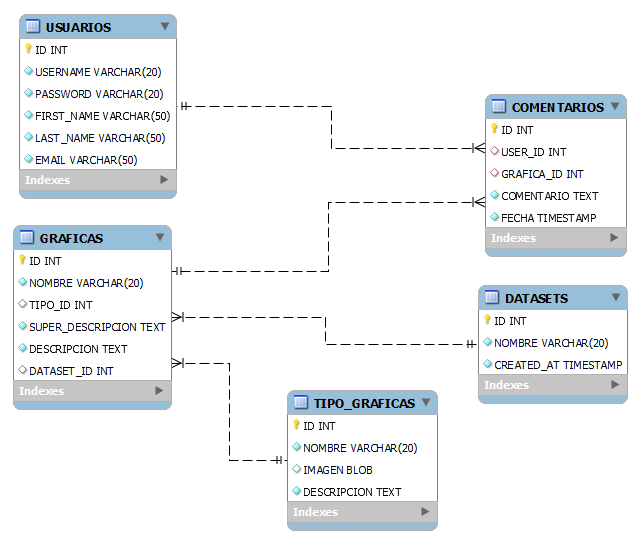

# Graphic Report NodeJs

Una aplicación Node js que plotea gráficos desde archivos .csv importados por los usuarios.

# What I Learned

* Developed a user interface using handlebars and Bootstrap.
* Implemented functinality using NodeJS Backend with SQL queries.
* Integrated Front-end with Chart.js to obtain the data through ajax from the server.

## Descripción

La integración con las vistas se realizó con Handlebars.

## Inicio

### Dependencias

* bcryptjs, csv-parser, csvtojson, express, mysql, morris-js-module.
* Sistema Operativo Independiente

### Instalación

* Clonar el repositorio
```
git clone https://github.com/Capdoo/nodejs-graphic-report
```

* Crear la Base de Datos usando MySQL
```
CREATE DATABASE BDMIGRANA CHARACTER SET utf8 COLLATE utf8_general_ci;
```


### Descargar dependencias

* Es necesario instalar las dependencias en el proyecto

```
npm i
```

## Ejecución

Iniciar el proyecto con el sgte comando.
```
npm run dev
```


## Diagrama ER


## Authors

Contribuidores y enlaces

. [@Capdoo](https://github.com/Capdoo)


## License

This project is licensed under the terms of the MIT license.

## Acknowledgments

NodeJs y Handlebars
* [Using Handlebars With Nodejs - Medium](https://waelyasmina.medium.com/a-guide-into-using-handlebars-with-your-express-js-application-22b944443b65)
